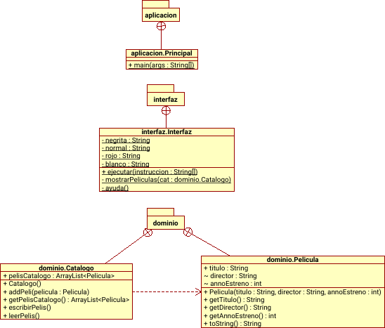

# Catálogo de películas

Esta aplicación de un catálogo de películas, permite que se añadan, borren y muestren las películas que hay en él.

## Instalación

Para instalar la aplicación, introduzca: **`make jar`**

## Ejecución

Para ejecutar el archivo .jar que se acaba de generar, teclee: **`java -jar catalogoPelis.jar <instruccion>`**

Las instrucciones que se pueden introducir son:
	
	java -jar catalogoPelis.jar anadir <"titulo"> <"director"> <año de estreno> - Permite añadir una nueva película al catálogo

	java -jar catalogoPelis.jar mostrar - Muestra las películas que hemos añadido anteriormente. En caso de que no haya ninguna película no hará nada

	java -jar catalogoPelis.jar borrar <id> - Permite borrar una película del catálogo introduciendo su id

	java -jar catalogoPelis.jar ayuda - Enseña una ayuda con las instrucciones que se pueden ejecutar

	java -jar catalogoPelis.jar modificar <id> <nuevo titulo> <nuevo director> <nuevo año de estreno>

Ejemplos:

	java -jar catalogoPelis.jar anadir "Mujercitas" "Gillian Armstrong" 1994
	
	java -jar catalogoPelis.jar mostrar

	java -jar catalogoPelis.jar borrar 2

	java -jar catalogoPelis.jar ayuda

	java -jar catalogoPelis.jar modificar 2 "Mujercitas" "Gary Ross" 1998

**Si al ejecutar alguno de estos comandos diese un error, borre el catálogo y creélo de nuevo añadiendo una película.**

## Generación del Javadoc

Por último para poder generar el javadoc de todo el proyecto escriba: **`make javadoc`**. Al hacerlo el javadoc aparecerá en el directorio (una carpeta) html.

## Estructura de la aplicaión

El siguiente diagrama UML muestra los paquetes y las clases del programa.

El paquete 'dominio' contiene las clases 'Pelicula.java' y 'Catalogo.java', la primera de ellas contiene las propiedades de la película y la segunda las funcionalidades del catálogo, como añadir o borrar.

El paquete 'interfaz' contiene la clase 'Interfaz.java' que es la interfaz del usuario

El paquete 'aplicacion' contiene la clase 'Principal.java' que es la que inicia el programa

